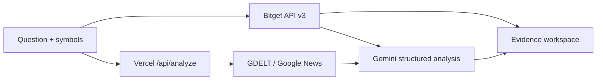

# RippleMap

**Live, evidence-disciplined cross-asset event research.**

[Open the product](https://ripplemap-three.vercel.app) · [Launch the workspace](https://ripplemap-three.vercel.app/app) · [System health](https://ripplemap-three.vercel.app/api/health)

RippleMap lets a researcher describe a market-moving event, select real Bitget instruments, and build conditional transmission paths grounded in a current market snapshot and recent reporting. It separates observations from inference: a 24-hour price move is evidence of movement, not proof of causality.

## Why it exists

Fast-moving headlines invite confident market narratives before the evidence is clear. RippleMap makes that reasoning inspectable by showing the live inputs, source leads, assumptions, caveats, and conditions that would invalidate an analysis.

## What is live

- Bitget API v3 instruments and ticker snapshots—no seeded prices.
- Recent reporting discovered through GDELT DOC 2.0, with Google News RSS fallback.
- Gemini 3.6 Flash structured analysis constrained to supplied evidence.
- Source links, evidence quality, caveats, and invalidation conditions.
- A public health endpoint that reveals readiness without exposing secrets.

## Architecture



The browser fetches market data directly from Bitget. The Vercel function performs server-side source discovery and Gemini analysis, so the API key never reaches the client. Event text remains unverified user context; article titles are research leads rather than verified facts.

## Run locally

Requirements: Node.js 20+ and the [Vercel CLI](https://vercel.com/docs/cli).

```bash
git clone https://github.com/ezekiel6262/ripplemap.git
cd ripplemap
cp .env.example .env.local
vercel dev
```

Set `GEMINI_API_KEY` in `.env.local`. The Bitget, GDELT, and Google News endpoints used here do not require credentials.

## Repository map

```text
api/analyze.js       source retrieval and Gemini analysis
api/health.js        deployment readiness endpoint
api/_lib/security.js validation, throttling, timeouts, response helpers
dist/index.html      public product homepage
dist/app.html        live research workspace
vercel.json          function limits and security headers
```

## Safety and reliability

- Gemini credentials stay server-side and output follows a JSON schema.
- Requests have size limits, throttling, and upstream timeouts.
- Security headers restrict framing, browser permissions, and network destinations.
- Source retrieval degrades gracefully when an upstream index is unavailable.
- The UI never substitutes a symbol when Bitget rejects the requested one.

## Limitations

RippleMap is a research aid, not financial advice. It does not prove causality, execute trades, personalize recommendations, or verify the full text of every indexed article. Source coverage may be incomplete or noisy; users should verify primary sources before relying on a claim.

## License

Released under the [MIT License](LICENSE).
